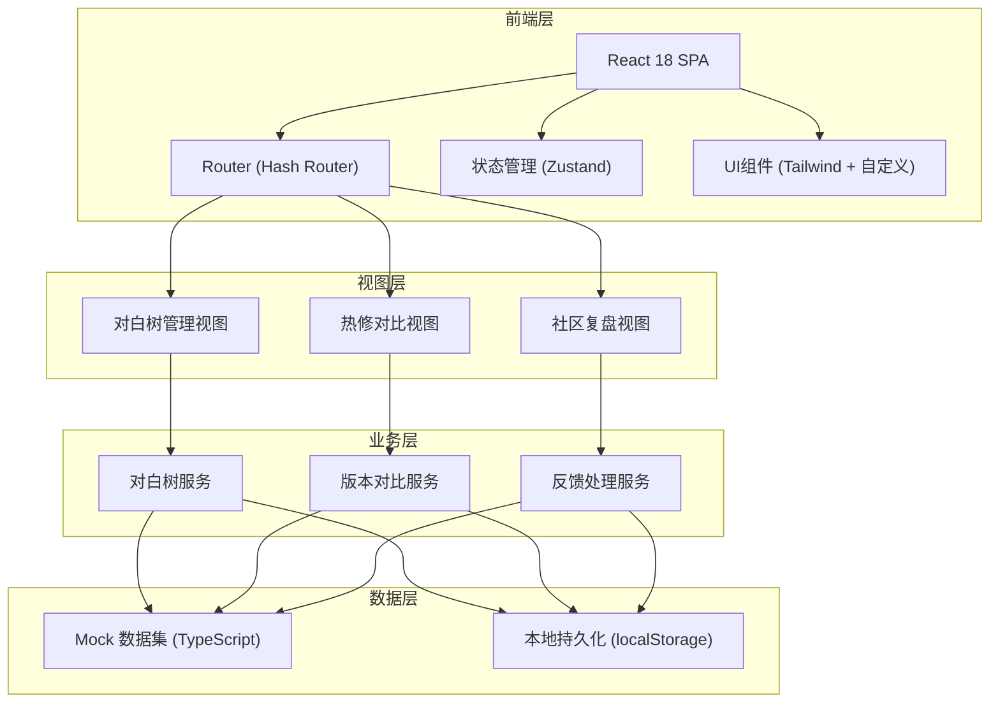

## 1. 架构设计



## 2. 技术栈说明

- **前端框架**: React@18 + TypeScript@5
- **构建工具**: Vite@5
- **路由方案**: react-router-dom@6（Hash Router，无需后端配置）
- **状态管理**: Zustand（轻量级，适合中等复杂度）
- **样式方案**: TailwindCSS@3 + PostCSS + Autoprefixer
- **图标库**: lucide-react（轻量现代图标集）
- **树可视化**: 原生 SVG + 自定义交互逻辑（避免引入大型图库）
- **数据**: TypeScript 类型定义 + Mock 数据（无需后端）

## 3. 路由定义

| 路由 | 页面名称 | 核心子组件 |
|------|----------|------------|
| `/` | 对白树管理页 | ChapterList, DialogTreeCanvas, NodePropertyPanel |
| `/diff` | 热修对比页 | VersionSelector, DiffViewer, SuspenseChecker |
| `/review` | 社区复盘页 | FeedbackBoard, TodoGenerator, TraceabilityMap |

## 4. 核心数据模型

### 4.1 对白树数据模型

```typescript
// 节点类型
type NodeType = 'dialog' | 'choice' | 'ending' | 'condition';

// 情绪维度
interface EmotionProfile {
  fear: number;      // 恐惧强度 0-100
  tension: number;   // 紧张度 0-100
  trust: number;     // 对角色信任度 -50~50
  hope: number;      // 希望值 0-100
}

// 对白节点
interface DialogNode {
  id: string;
  type: NodeType;
  chapterId: string;
  speaker: string;       // 说话角色
  text: string;          // 对白文本
  position: { x: number; y: number };
  emotion: EmotionProfile;
  visibleInfo: string[]; // 玩家可见的信息点
  conditions?: string;   // 触发条件表达式
  choices?: DialogChoice[]; // 选项（choice类型）
  nextNodeId?: string;   // 下一节点（非choice类型）
  controversy?: number;  // 争议度 0-100
  tags: string[];
}

// 对话选项
interface DialogChoice {
  id: string;
  label: string;        // 选项文案
  nextNodeId: string;   // 跳转节点
  weight?: number;      // 选项权重（隐藏分支判定用）
  reaction?: string;    // 玩家选择后的即时反应文本
}

// 章节
interface Chapter {
  id: string;
  title: string;
  type: 'main' | 'side' | 'event' | 'dlc';
  order: number;
  nodeCount: number;
  controversy: number;  // 章节平均争议度
  lastUpdated: string;
  version: string;
}
```

### 4.2 版本对比数据模型

```typescript
// 版本快照
interface VersionSnapshot {
  id: string;
  name: string;
  createdAt: string;
  createdBy: string;
  chapterId: string;
  nodes: DialogNode[];
  tags: string[];
  description: string;
}

// 差异项类型
type DiffType = 'text' | 'emotion' | 'choice' | 'condition' | 'visible_info';
type DiffSeverity = 'low' | 'medium' | 'high' | 'critical';

// 节点差异
interface NodeDiff {
  nodeId: string;
  diffType: DiffType;
  severity: DiffSeverity;
  field: string;
  oldValue: any;
  newValue: any;
  suspenseRisk?: boolean; // 是否有悬念破坏风险
  description: string;
}

// 章节差异报告
interface DiffReport {
  chapterId: string;
  oldVersion: VersionSnapshot;
  newVersion: VersionSnapshot;
  nodeDiffs: NodeDiff[];
  summary: {
    totalChanges: number;
    highRiskCount: number;
    emotionDelta: EmotionProfile;
    suspenseWarnings: string[];
  };
}
```

### 4.3 社区反馈数据模型

```typescript
// 反馈来源
type FeedbackSource = 'steam' | 'taptap' | 'weibo' | 'discord' | 'official_forum';

// 玩家反馈
interface PlayerFeedback {
  id: string;
  content: string;
  source: FeedbackSource;
  author: string;
  createdAt: string;
  mentionCount: number;   // 被引用/回复次数
  heat: number;           // 热度值
  keywords: string[];     // 关键词标签
  relatedNodeId?: string; // 关联的对白节点
  sentiment: 'negative' | 'neutral' | 'positive';
}

// 复盘待办
interface ReviewTodo {
  id: string;
  title: string;
  description: string;
  priority: 'low' | 'medium' | 'high' | 'urgent';
  status: 'pending' | 'processing' | 'resolved' | 'rejected';
  feedbackIds: string[];
  relatedNodeId?: string;
  assignee: string;
  createdAt: string;
  resolvedAt?: string;
  resolvedVersion?: string;
}

// 回流追踪链路
interface TraceLink {
  id: string;
  feedbackId: string;
  todoId?: string;
  nodeId?: string;
  versionId?: string;
  stage: 'feedback' | 'todo' | 'edit' | 'release';
  timestamp: string;
}
```

## 5. 目录结构

```
src/
├── assets/              # 静态资源（字体、图片）
├── components/
│   ├── common/          # 通用组件（Button, Card, Modal, Slider等）
│   ├── layout/          # 布局组件（Sidebar, Header, ThreeColumnLayout）
│   ├── dialogTree/      # 对白树模块组件
│   │   ├── ChapterList.tsx
│   │   ├── TreeCanvas.tsx
│   │   ├── TreeNode.tsx
│   │   └── PropertyPanel.tsx
│   ├── diff/            # 热修对比模块组件
│   │   ├── VersionSelector.tsx
│   │   ├── DiffColumn.tsx
│   │   ├── EmotionDiff.tsx
│   │   ├── FearCurve.tsx
│   │   └── SuspenseAlert.tsx
│   └── review/          # 社区复盘模块组件
│       ├── FeedbackCard.tsx
│       ├── FeedbackBoard.tsx
│       ├── TodoGenerator.tsx
│       ├── TodoList.tsx
│       └── TraceFlow.tsx
├── data/
│   ├── chapters.ts      # 章节mock数据
│   ├── nodes.ts         # 对白节点mock数据
│   ├── versions.ts      # 版本快照mock数据
│   ├── feedbacks.ts     # 玩家反馈mock数据
│   └── todos.ts         # 待办mock数据
├── hooks/               # 自定义hooks
├── store/               # Zustand状态管理
│   ├── useDialogStore.ts
│   ├── useDiffStore.ts
│   └── useReviewStore.ts
├── types/               # TypeScript类型定义
├── utils/               # 工具函数
├── App.tsx
├── main.tsx
└── index.css
```

## 6. 状态管理分区

### 6.1 对白树状态 (useDialogStore)
```typescript
{
  chapters: Chapter[];
  nodes: Record<string, DialogNode>;
  currentChapterId: string | null;
  selectedNodeId: string | null;
  viewport: { x: number; y: number; zoom: number };
  // actions
  selectChapter(id): void;
  selectNode(id): void;
  updateNode(id, patch): void;
  addNode(parentId, node): void;
  setViewport(vp): void;
}
```

### 6.2 版本对比状态 (useDiffStore)
```typescript
{
  versions: VersionSnapshot[];
  oldVersionId: string | null;
  newVersionId: string | null;
  diffReport: DiffReport | null;
  // actions
  selectVersions(oldId, newId): void;
  computeDiff(): void;
  saveAsVersion(name, desc): string;
}
```

### 6.3 社区复盘状态 (useReviewStore)
```typescript
{
  feedbacks: PlayerFeedback[];
  todos: ReviewTodo[];
  traces: TraceLink[];
  // actions
  createTodoFromFeedback(feedbackIds): ReviewTodo;
  linkTodoToNode(todoId, nodeId): void;
  updateTodoStatus(id, status): void;
  addTrace(link): void;
}
```
