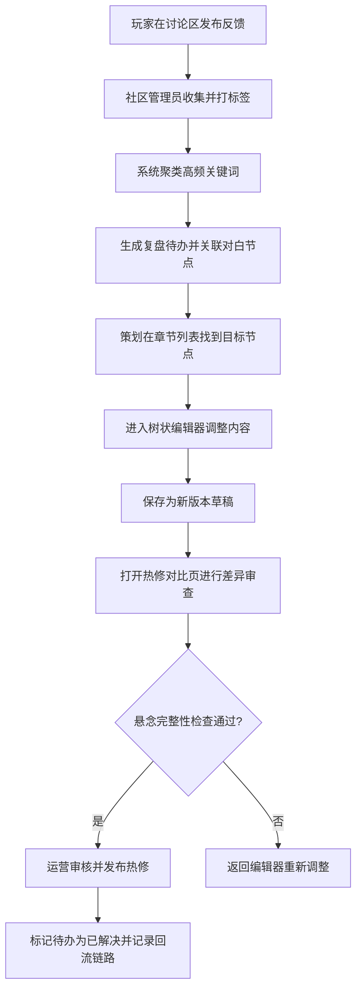

## 1. 产品概述

「对白树管理后台」是面向恐怖游戏运营和社区内容策划的专业工具，用于处理章节制叙事恐怖项目的版本更新、活动番外和玩家反馈后的热修正。运营人员可以快速定位高争议对白节点，在树状编辑器中调整选项文案、触发条件和后续反应，无需重做整章内容。

- **目标用户**：游戏运营人员、叙事策划、社区内容管理员
- **核心价值**：提升热修效率，保护叙事悬念完整性，建立玩家反馈到内容迭代的闭环

---

## 2. 核心功能

### 2.1 用户角色

| 角色 | 登录方式 | 核心权限 |
|------|----------|----------|
| 叙事策划 | 账号密码登录 | 管理对白树、编辑节点内容、发布热修版本 |
| 运营人员 | 账号密码登录 | 查看对白树、发起热修对比、审核版本变更 |
| 社区管理员 | 账号密码登录 | 整理玩家反馈、创建复盘待办、回流标记 |

### 2.2 功能模块

1. **对白树管理模块**：章节列表导航、树状可视化编辑器、节点属性面板、触发条件配置、分支反应编辑
2. **热修对比模块**：版本选择器、三栏差异视图（可见信息/角色态度/恐惧强度）、悬念完整性检查、版本发布控制
3. **社区复盘模块**：玩家反馈列表、关键词聚类标签、待办生成器、回流标记追踪、统计看板

### 2.3 页面详情

| 页面名称 | 模块名称 | 功能描述 |
|----------|----------|----------|
| 对白树管理页 | 章节列表 | 按章/节/活动分类展示，带争议度热度条、筛选搜索 |
| 对白树管理页 | 树状画布 | SVG渲染的节点连接图，支持拖拽平移缩放，节点颜色表示类型/状态 |
| 对白树管理页 | 属性面板 | 选中节点后的编辑区：对白文本、选项配置、条件表达式、情绪值 |
| 热修对比页 | 版本选择 | 下拉选择新旧版本，支持按时间/标签筛选历史版本 |
| 热修对比页 | 差异视图 | 三栏并排对比：玩家可见信息、角色态度数值、恐惧强度曲线，差异高亮标注 |
| 热修对比页 | 悬念检查 | 自动扫描并标记可能破坏悬念的修改（如关键伏笔删除、转折提前暴露） |
| 社区复盘页 | 反馈看板 | 玩家评论卡片流，带关键词标签、来源社区、提及次数、热度值 |
| 社区复盘页 | 待办生成 | 一键将反馈转为待办，自动关联对应对白节点，设置优先级和处理状态 |
| 社区复盘页 | 回流追踪 | 可视化展示反馈→待办→热修→新版本的完整链路闭环 |

---

## 3. 核心流程

运营人员处理玩家反馈的典型流程：

---

## 4. 用户界面设计

### 4.1 设计风格

- **主题色**：深渊黑 `#0a0a0f` 为主背景，血色红 `#8b0000` 为强调色，昏黄 `#c9a227` 为高亮，幽灵白 `#e8e6e3` 为文本
- **辅助色**：紫黑渐变 `#1a0a2e` 用于卡片，暗绿 `#1a2f1a` 标记安全，暗红 `#3d0a0a` 标记危险
- **按钮风格**：微立体浮雕感，窄边框圆角 2px，悬停时有红色辉光脉动
- **字体选择**：显示字体用「霞鹜文楷」或「思源宋体」营造古典恐怖氛围，正文字体用「思源黑体」保证可读性
- **布局风格**：三栏式主布局（左导航+中画布/内容+右属性面板），卡片带内阴影和细边框
- **图标/emoji风格**：使用哥特风格线性图标，节点用不同几何形状区分（菱形=抉择点，圆形=对白，方块=结局）

### 4.2 页面设计概览

| 页面名称 | 模块名称 | UI元素 |
|----------|----------|--------|
| 对白树管理页 | 章节列表 | 折叠树+热度渐变条+悬停时显示争议关键词标签 |
| 对白树管理页 | 树状画布 | 深色背景带噪点纹理，节点发光边框，贝塞尔曲线连接线，选中节点有红色呼吸光圈 |
| 对白树管理页 | 属性面板 | 分区折叠卡片，输入框带焦点辉光，情绪值用多色渐变滑块 |
| 热修对比页 | 差异视图 | 旧版用删除线+浅红遮罩，新版用下划线+浅绿背景，差异数值用箭头指示升降 |
| 热修对比页 | 悬念检查 | 警告条带闪烁图标，点击跳转至对应差异位置 |
| 社区复盘页 | 反馈看板 | 瀑布流卡片，热度高的卡片边框变粗并带脉动动画 |
| 全局 | 导航栏 | 左侧竖向导航，选中项有侧边红色指示条，图标带悬停微动效 |

### 4.3 响应式设计

桌面端优先设计，宽屏（≥1440px）展示完整三栏布局；中等屏幕（1024-1440px）可折叠属性面板；移动端仅保留核心列表视图，编辑操作需在桌面完成。

---

## 5. 非功能性需求

- **性能**：树状画布支持 1000+ 节点流畅交互，差异对比加载时间 ≤ 2s
- **数据安全**：所有编辑操作自动保存草稿，版本历史保留 30 天可回滚
- **可扩展性**：节点类型、情绪维度、对比指标均可配置化扩展
